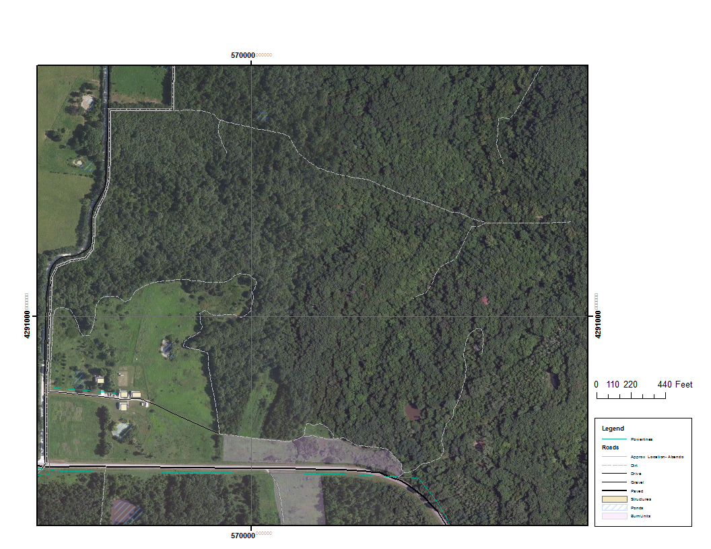

```{r echo=FALSE, warning=FALSE, message=FALSE}
library(rFEMO)
library(lubridate)

setwd("/Users/danielgodwin/Dropbox/Graduate School/Papers In Work/rFEMO/20150708_BearCreekRx")
```
********

# Summary Page

## Overview

**Project / Fire Name:**  Bear Creek Prescribed Fire  
**Unit / Sub-unit Name:**  Unit 2  
**Date of Fire:**  08 July 2015  
**Observer(s):**  Jane Q. Femo  
  
    
**Date of Report:**  10 July 2015  
**Reporter(s):**  Jim P. Fobs  

## Unit Settings

**Acres:**  38
**Elevation:**  2100
**Slope:**  Minimal
**Aspect:**  South
  
  
**UTM Zone:**  36 N
**Northing:**  423789
**Easting:**   423498

********
# Weather Observations

```{r kestrelData, echo=FALSE, include=FALSE, eval=FALSE}
# To make the kestrel data be processed, change the above to include = TRUE.

# kestrelObservations <- read.csv("Data/Weather/kestrel.csv",header = TRUE, skip = 1)

```

## Hand Collected Data

### Temperature Observations

```{r handWeatherData, echo=FALSE,warning=FALSE}

# Make sure to change the path after 'file =' below to the name of your weather observations.

weatherObservations <- read.csv(file = "Data/WeatherObservations/20150708_BearCreekRx_FirelineWeatherObservations.csv", skip = 1)

weatherObservations$DateTime <- paste(weatherObservations$Date_ddmmyyyy," ",weatherObservations$Time_hhmm)

weatherObservations$DateTime <- dmy_hm(weatherObservations$DateTime)
```

```{r TemperatureObservations, echo=FALSE,warning=FALSE, fig.cap="Temperature Observations"}
tempPlot(Temp = weatherObservations$Temperature_F,
         DateTime = weatherObservations$DateTime, 
         Temp_HighBoundary = 75) 
```

### Relative Humidity Observations

```{r RHObservations, echo=FALSE, warning=FALSE, fig.cap="RH Observations"}
rhPlot(RH = weatherObservations$RH,
       DateTime = weatherObservations$DateTime,
       RH_LowBoundary = 25,
       RH_HighBoundary = 75)
```

### Wind Observations

```{r WindObservations, echo=FALSE,warning=FALSE,fig.cap="Wind Observartions"}
weatherObservations$windDegree <- as.numeric(as.character(
  windConvert(cardinalWind = weatherObservations$Direction,
  LightAndVariable = "L/V")))

weatherObservations$Windspeed_mph[weatherObservations$Windspeed_mph == "L/V"] <- NA
weatherObservations$Windspeed_mph <- as.numeric(weatherObservations$Windspeed_mph)

windPlot(DateTime = weatherObservations$DateTime,
         windDegrees = weatherObservations$windDegree,
         windSpeed = weatherObservations$Windspeed_mph)
```

# Managed Fire Objectives

  Objectives  | Estimated Fire Effects     |      Achieved?
--------------|----------------------------|----------------------
Maintain or increase prairie species present | Brome consumption low due to high fuel moisture.| **Unknown**
Topkill 75% of woody species | Overall: 50-80% topkill of shrubs. Some areas exhibited blistering. | **Yes**


# Monitoring Narrative

Plots were placed at three places in the burn unit (see attached map).  Soil moisture was high throughout, with duff and thatch largely unconsumed.  No areas burned down to bare mineral soil unless heavies were present.  Seventy five to 85% of the unit was blackened.  Brome averaged 60% consumption.

# Figure

  

# Maps

  
