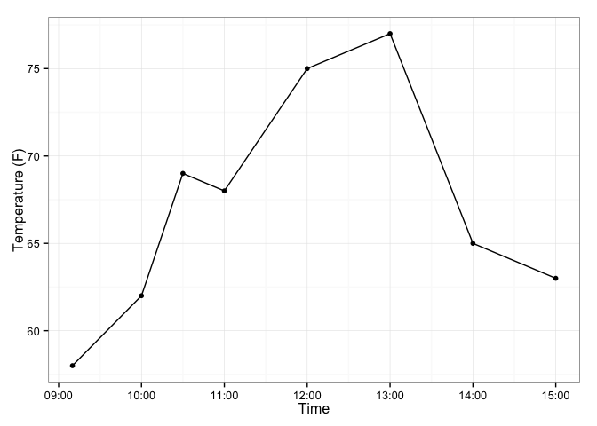
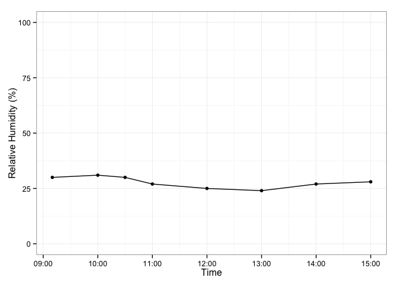
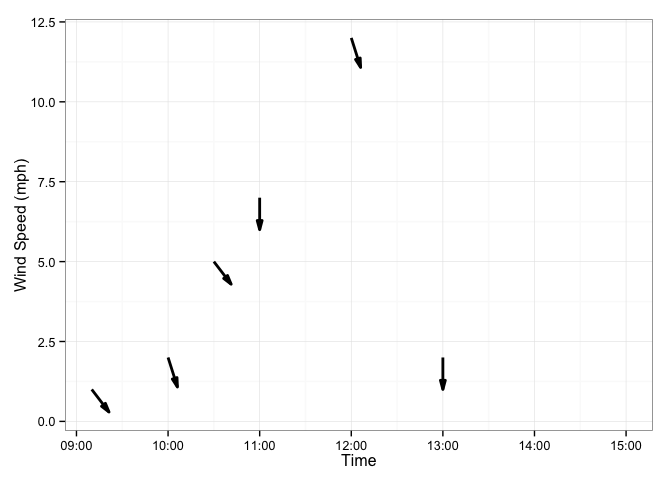

# Example FEMO Report

# Summary Page

## Overview

<!-- Make sure to include two spaces after each item to create a line break. -->

**Project / Fire Name:**  Example Burn  
**Unit / Sub-unit Name:**  Demo Unit 2  
**Date of Fire:**  21 February 2015  
**Observer(s):**  Jane Q. Femo  
  
    
**Date of Report:**  01 March 2015  
**Reporter(s):**  Jim P. Fobs  

## Unit Settings

**Acres:**  
**Elevation:**  
**Slope:**  
**Aspect:**  
  
  
**UTM Zone:**  
**Northing:**  
**Easting:**  

********
# Weather Observations

<!-- ## Kestrel Data  -->
<!-- The line above will control whether kestrel data is include as a header.  -->
<!--  Remove the brackets to make it appear.                                   -->

## Hand Collected Data

### Temperature Observations

 

### Relative Humidity Observations

 

### Wind Observations

 

# Managed Fire Objectives

  Objectives  | Estimated Fire Effects     |      Achieved?
--------------|----------------------------|----------------------
Maintain or increase prairie species present | Brome consumption low due to high fuel moisture.| **Unknown**
Topkill 75% of woody species | Overall: 50-80% topkill of shrubs. Some areas exhibited blistering. | **Yes**

# Monitoring Narrative

Plots were placed at three places in the burn unit (see attached map).  Soil moisture was high throughout, with duff and thatch largely unconsumed.  No areas burned down to bare mineral soil unless heavies were present.  Seventy five to 85% of the unit was blackened.  Brome averaged 60% consumption.

# Photographs
